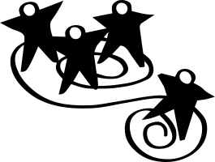

# 大型智囊团
（英文: Wise Crowds for Large Groups）

> 在快速循环中挖掘大型群体的集体智慧

**编号**：第 13 号微结构

**时长**：60-60 分钟

## What
### 什么成为可能
每一次旅行都有旅行者所没有预期的一个秘密目的地。(Martin Buber 马丁-布伯)智囊团让或大或小的群体随时互相提供帮助成为可能。您可以为一个四到五人的小团体或多个小团体同时并发使用智囊团，或者在一个较大型的集会中，让一个大到一百人或更多的群体使用此LS方法手段。作为"客户"的个体可以向所有其他成员寻求帮助，并在短时间内实现。每一个体的咨询环节都能同时挖掘群体中每个人的专业知识和创造力。个体的思路变得清晰透彻，并提高自我修正和自我理解的能力。智囊团培养人们的求助能力；人们加深其探究和咨询技能；相互支持的关系会很快形成。在智囊团的活动中，一系列的个体咨询使大家的学习不断长进，因为每个参与者不仅从成为“客户”的过程中受益，也能从连续多次作为咨询顾问的过程中受益，透明性也轻松得以实现。群策群力，胜过所谓的专家!
### 其他信息
请参考LS官方网站（上面包含一些实战图片及图例）
### 原始作者
由Henri Lipmanowicz和Keith McCandless开发的LS共创工具。受到贵格会清晰委员会(Quaker Clearness Committee)的启发
由上海优普丰企业管理咨询敏捷AI培训机构的顾问、学员、志愿者团队共同翻译。

## How
### 打造邀请
- 请担当“客户”的参与者描述自己所面对的挑战，工作的当前进展，及所需要的意见
- 请其他参与者充当多个"咨询师团队"。他们的任务是帮助"客户"明确自己的挑战，并提出意见或建议

### 所需空间和材料
- 在房间前面位置为“客户”准备一把椅子
- 在确实不可或缺的情况下才需要准备屏幕和投影仪
- 在会议室前排为三位主咨询师提供椅子
- 另外，每个卫星咨询师小组5-8把椅子围着小桌子，或不设桌子围成一圈
- 供参与者做笔记的纸
- 每个小组写建议用的索引卡（或便签纸）
- “客户”和主咨询师用的麦克风

### 参与方式
- 客户有预定的时间盒来做介绍和寻求帮助
- 主咨询师团队也有固定的时间盒来提供帮助
- 每个卫星咨询师团队的成员都有平等的机会在余下的时间里贡献帮助，这也是遵循固定时间盒的

### 分组方式
- 客户个人
- 主咨询师团队由2至3人组成
- 任何数量的卫星咨询师小组，每组5至7人
- 跨职能、跨层级、跨专业的混合团队是理想的选择
### 步骤和时间分配
每个要求咨询的人（客户）都有共1小时的时间，具体步骤如下：- 客户提出所需要咨询的问题，选择2-3人组成主咨询师团队。主要咨询师坐到房间前排的椅子。2分钟
- 客户说明挑战并求助。10分钟
- 主咨询师向客户发出澄清提问，使用麦克风，以让所有参与者都能听到。10分钟
- 客户背对着主咨询师，准备做笔记
- 主咨询师团队在内部形成意见和建议，客户背对着他们。团队讨论时使用麦克风，这样房间里的所有其他人都可以跟上他们的讨论。7分钟
- 每个卫星咨询师团队各自在内部对主咨询师的工作产出进行点评，并为客户产生自己小组的建议。10分钟
- 在卫星小组内部讨论的时候，客户转过身来，利用这十分钟的时间与主咨询师们讨论
- 先做一轮收集各卫星小组对主咨询师团队的点评意见，再做第二轮收集每个小组的建议。每个小组只收集一个意见或建议，不要重复。可以请各卫星小组将他们对客户的建议写在3×5英寸的索引卡（或者便签纸）上。10分钟
- 客户向咨询师们反馈：哪些是有用的，哪些是他（她）会带回工作中的。2分钟
- 请集体交流，反思刚才的过程，并讨论So What，Now What（那又如何，现在又如何）。5分钟
注意：每一步的时间可以根据问题的复杂程度和小组的规模进行调整，但一定要严格按照时间表进行，不要让讨论拖到规定的时间之外。若有需要额外时间，重新再来一轮。### 小贴士和小坑
- 邀请多元化的人群来参与（不仅只是专家和领导）
- 当参与者掉入陷阱时，请他们进行自我批判（例如，在明确目的或问题之前就匆忙制定行动）
- 参见[[启发式帮助]]，了解帮助别人或寻求帮助时“避免模式“的完整清单
- 提醒参与者尽量把注意力集中在客户的直接体验上，问："发生了什么？你的体验如何？"
- 建议咨询师在保持同情心的同时勇于冒险探索
- 若时间允许，避免让一些参与者选择不做客户：每个人至少贡献一个挑战!
- 如果第一轮疲软，可以尝试第二轮
- 请参与者勇于提出貌似没有简单答案的复杂挑战，要知难而上
### 即兴发挥
- 请参考[[智囊团]]的相关内容

## Why
### 目的
- 产生持久的结果，因为每个人及群体在没有"外部专家"的情况下共同创造了这些成果
- 提升给予、接受和请求帮助的技能
- 挖掘整个团队的智慧，而不需要冗长耗时的演讲
- 释放跨专业、跨职能部门的智慧和创造力
- 用有效和有用的替代方案取代枯燥乏味的更新汇报
- 通过相互支持和同伴连接，积极建立信任
- 练习全心全意的倾听
### 示例
- 请参考[[智囊团]]的相关内容
