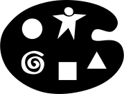

# 携手共画
（英文: Drawing Together）

> 通过非语言表达方式揭示洞察和指明前进的道路

**编号**：第 20 号微结构

**时长**：40-40 分钟

## What
### 什么成为可能
整个身体追从生动的想象力。(亚里士多德 Aristotle)通过携手共画，你可以帮助人们获取隐藏的知识，比如情感、态度、模式等难以用语言表达的东西。当人们疲惫不堪时，或是其大脑满得已经达到逻辑思维的极限时，你可以帮助他们唤起逻辑之外的想法，一步步拥抱各种可能。这是关于个人或群体蜕变的故事，并可以用五个简单易画、具有普遍意义的符号来讲述。携手共画充满着玩耍精神，昭示着更多的可能，期待着许多新的答案。携手共画切中了过度依赖说和写的习惯的要害，因为说写制约了新奇事物的出现。它还为一些人提供了一个全新的表达途径，刺激他们的新想法。
### 其他信息
请参考LS官方网站（上面包含一些实战图片及图例）<https://www.liberatingstructures.com/20-drawing-together/>
### 原始作者
由Henri Lipmanowicz和Keith McCandless开发的LS共创工具。受到 David Sibbet (参看 <The Grove>) 及 Angeles Arrien的启发 (参看著作：Signs of Life: The Five Universal Shapes and How to Use Them)
由上海优普丰企业管理咨询敏捷AI培训机构的顾问、学员、志愿者团队共同翻译。

## How
### 打造邀请
- 请参与者讲述一个关于他们所面临或常见的挑战的故事，只能用五个符号，且不使用任何文字

### 所需空间和材料
- 一面开阔的墙，挂毯纸或有空白页的翻页架
- 水性记号笔；或者色彩丰富的柔和粉笔

### 参与方式
- 每个人都包括在内，因为这五个符号对每个人来说都很容易画
- 所有参与者同时进行个人绘画

### 分组方式
- 个人单独练习画符号
- 个人来制作其图画的初稿和二稿
- 2-5人的小组内来解读图画
- 全员汇报总结（人多的话使用[1-2-4-All](/1-1-2-4-all)）
### 步骤和时间分配
- 主持人画出并描述每个符号的含义，以及介绍携手共画。5分钟
	圆形 = 整体	矩形 = 支持	三角形 = 目标	螺旋 = 变化	星型人[等距交叉形式] = 关系- 请大家练习画五个符号：圆形、矩形、三角形、螺旋、星型人。5分钟
- 请每个人自己结合这些符号，单独及不加文字地创作一个故事的初稿，讲述在挑战或创新中工作的"历程"。10分钟
- 请每个人创作第二稿，通过戏剧化符号的大小、位置和颜色来完善他们的故事。10分钟
- 请参与者邀请另一个人或他们的小组来解释每一张画。提醒大家，创作该画的人不说话。5分钟
- 问全组："一起看，这些画揭示了什么？" 人数较多时采用[1-2-4-All](/1-1-2-4-all)。5分钟
### 小贴士和小坑
- 提醒学员绘画本身不是目标，说："大家并不需要精良的绘画技巧--克服你对完美的追求! 充满童趣的画作看起来很好玩，也能激发别人的想象力！"
- 不需要帮助大家的绘画技巧
- 帮助参与者接受图画中出现的任何东西（往往会有惊喜）
- 画出或展示一个故事的例子，帮助他人快速认识这个方式
- 用照相机和录像机记录参与者的绘画过程
- 当你以后再次召开相关会议时，利用好这些图画
- 请记住，绘画会是强大的手段；准备好应对情绪反应
### 即兴发挥
- 请人在会议中直观地绘制出对话图（视觉记录，也可以按需要添加文字）
- 从小处入手：用一张普通A4纸开始
- 可以用平板电脑代替纸张，让大家学习如何用平板电脑上的五个符号讲故事
- 以《英雄之旅》为模板，编写故事
- 作为一个模板，从揭示现状到呼唤新事物，发现、验证、早期采用、及传播的过程

## Why
### 目的
- 揭示通过口头或线性方法无法获得的见解或理解
- 挖掘带来创新的所有知识来源（显性、隐性、潜在/新兴）
- 发出信号，表示正在进行探索或寻找新发现的旅程
- 发展和加深对愿景或复杂动态状况的共同理解
- 在小组成员之间建立更紧密的关系
### 示例
- 在漫长的会议中，当需要创造力的爆发时，可以用于改变节奏并带来新鲜感
- 当观点差异较大，群体陷入困境时
- 用于会议的视觉引导，随着交流的展开而创作图画
- 用于在复杂的项目工作时，揭示晦涩或隐藏的关系（例如，一位博士生通过携手共画获得了一个灵光乍现的时刻）
- 为了更鲜活地呈现一个愿景声明（特别是对于视觉导向的人）
- 就个人工作而言，应对挑战时，用来把不可言喻的或隐藏的方法手段可视化
