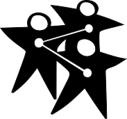
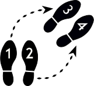

# Liberating Structures 中文索引

| 编号 | Icon | 中文标题 | 简介 |
|:----:|:----:|:--------:|:-----|
| 1 |  | [1-2-4-all](1-1-2-4-all) | 让大家同时参与讨论问题、思想激荡和提出建议 |
| 2 |  | [即兴社交](2-impromptu-networking) | 迅速分享挑战和期望，建立新的连接 |
| 3 |  | [9 Whys](3-nine-whys) | 明确你们合作的目的 |
| 4 |  | [悖论问题](4-wicked-questions) | 阐明一个团体要想成功必须面对的矛盾挑战 |
| 5 |  | [欣赏式访谈](5-appreciative-interviews-ai) | 发现和打造获得成功的根本原因 |
| 6 |  | [TRIZ](6-making-space-with-triz) | 停止适得其反的活动和行为，为创新腾出空间 |
| 7 |  | [15%解决方案](7-15-solutions) | 探索并聚焦于每个人现在就具备资源并可自由开展的行动 |
| 8 |  | [三人行咨询](8-troika-consulting) | 立即从同事那里获得实用和富有想象力的帮助 |
| 9 |  | [W³反思法](9-what-so-what-now-what-w) | 一起回顾迄今为止的进展，并决定需要进行哪些调整 |
| 10 |  | [探索行动对话](10-discovery-action-dialogue) | 发现、发明和发动解决长期存在的问题的落地实操办法 |
| 11 |  | [轮转和分享](11-shift-share) | 传播好的想法，并与创新者建立轻松有效的连接 |
| 12 |  | [25/10集体智慧](12-2510-crowd-sourcing) | 快速生成并筛选团队中最有力的可行想法 |
| 13 |  | [大型智囊团](13-wise-crowds) | 在快速循环中挖掘大型群体的集体智慧 |
| 14 |  | [最小规格](14-min-specs) | 明确为了实现目标的绝对"必须做"和"不必须做" |
| 15 |  | [即兴原型表演](15-improv-prototyping) | 在尽情嬉戏的同时，为长期的挑战制定有效的解决方案 |
| 16 |  | [启发式帮助](16-helping-heuristics) | 练习循序渐进的帮助他人、接受帮助和寻求帮助的方法 |
| 17 |  | [畅谈咖啡馆](17-conversation-cafe) | 让每个人都参与到对深刻挑战的认识中来 |
| 18 |  | [金鱼缸会谈](18-users-experience-fishbowl) | 与更大的团体分享经验成果 |
| 19 |  | [听到-看到-尊重](19-heard-seen-respected-hsr) | 练习更深入的倾听和与同事的共鸣 |
| 20 |  | [携手共画](20-drawing-together) | 通过非语言表达方式揭示洞察和指明前进的道路 |
| 21 |  | [设计故事板](21-design-storyboards) | 确定使会议取得成效的步骤要素 |
| 22 |  | [名人采访](22-celebrity-interview) | 借助名人的经验通过当面访谈的方式帮助访谈对象来应对即将到来的挑战 |
| 23 |  | [社交网络图](23-social-network-webbing) | 绘制非正式的关系网络图，思考决定如何加强网络中的关系联系，以达到最终目的 |
| 24 |  | [我需要你](24-what-i-need-from-you-winfy) | 明确各职能的基本需求，接受或拒绝支援请求 |
| 25 |  | [开放空间技术](25-open-space-technology) | 释放任何规模团体的内在行动力和领导力 |
| 26 |  | [STAR罗盘](26-generative-relationships-st) | 揭示能创造惊人价值或功能障碍的关系模式 |
| 27 |  | [共识-确定性矩阵](27-agreement-certainty-matrix) | 将挑战问题分为简单、复杂、极其复杂和混乱几个类型 |
| 28 |  | [实地观察访谈](28-simple-ethnography) | 观察和记录用户在实地的实际行为 |
| 29 |  | [整合-自主](29-integrated-autonomy) | 从"非此即彼"转向强大的"两全其美"解决方案 |
| 30 |  | [关键-不确定](30-critical-uncertainties) | 在一系列看似合理但不可预测的未来中开发策略 |
| 31 |  | [生态环](31-ecocycle-planning) | 分析所有的活动和关系组合，以确定进展的障碍和机会 |
| 32 |  | [扰沌](32-panarchy) | 理解嵌套式组织系统如何互动、发展、传播创新和转型 |
| 33 |  | [从目的到实践（P2P）](33-purpose-to-practice-p2p) | 设计五个基本要素，以实现弹性而持久的计划推进 |